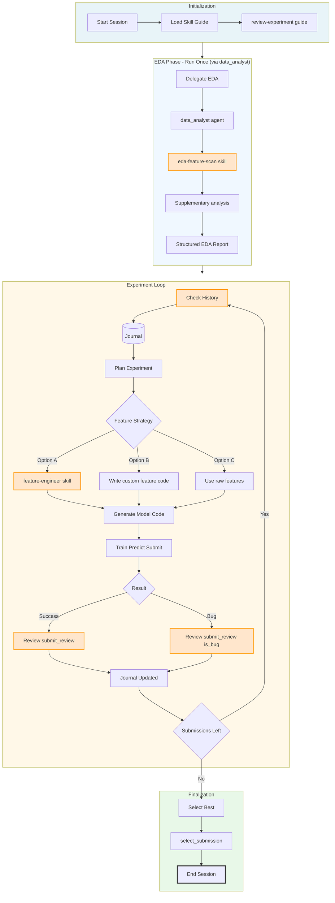

## 1- Create Agent & AutoML Agent Execution Flow

reference: AIDEML : https://github.com/WecoAI/aideml/blob/main/aide/agent.py
 

2 Legend

| Style | Meaning |
|---|---|
| 🟠 **Orange border** | **Skill call** — script under `skills/`, invoked via `run_command` |
| 🔵 **Blue arrow** | `agent_tool` — sub-agent delegation |
| ⚫ **Black arrow** | Standard tool call (`run_command`, `submit_predictions`, etc.) |

3 Step-by-Step Breakdown

| Step | Action | Tool / Skill | Output |
|------|--------|-------------|--------|
| 1 | Load journal guide | `run_command`: `cat skills/review-experiment/resources/experiment_journal_guide.md` | Behavior constraints |
| 2 | **Check history** 🟠 | `run_command`: `python skills/review-experiment/scripts/get_history.py` | JSON array of past experiments |
| 3 | **Delegate EDA** 🔵 | `agent_tool`: `data_analyst` | Structured EDA report (7 sections) |
| 3a | **Deep scan** 🟠 (mandatory) | `run_command`: `python skills/eda-feature-scan/scripts/parquet_feature_scan.py` | `encoding_map.json`, `fill_na_map.json`, etc. |
| 4 | Plan experiment | Internal reasoning | Hypothesis + expected CV delta |
| 5 | **Feature engineering** 🟠 | Option A: `feature-engineer` skill Option B: Custom code (`run_command`) Option C: Skip | Engineered features or raw data |
| 6 | Execute code | `run_command` or direct code | Trained model + predictions CSV |
| 7 | Submit predictions | `submit_predictions` | submission_id + public score |
| 8 | **Submit review** 🟠 ⭐ | `run_command`: `python skills/review-experiment/scripts/submit_review.py` | Appends to journal.jsonl |
| 9 | Loop back to Step 2 | — | — |
| 10 | Select final | `select_submission` | Best private-test score |

4 Feature Engineering Strategy (v11)

| Round | Option | When to Use |
|-------|--------|-------------|
| 1 | **C** (raw features) or **A** (feature-engineer) | **保底** — fastest baseline |
| 2 | **A** (feature-engineer full pipeline) | **保底** — imputation, row stats, datetime parts, categorical encoding |
| 3+ | **B** (custom code) | **创意加分** — domain-specific features from EDA insights; see `feature-engineer`'s `feature_recipes.md` for templates |

> **Rule**: Start with C or A. Use B only after baselines are established.

4.1 Skill Usage Summary

### `review-experiment` Skill (called twice per iteration)

| Call | When | Why | Args |
|------|------|-----|------|
| `get_history.py` | **Before every experiment** | Avoid repeating failed/identical approaches | `--limit 20 --filter_status all` |
| `submit_review.py` | **After every execution** | Record outcome for future planning | `--submission_id --is_bug --metric --lower_is_better --summary --tags` |

> ⭐ `submit_review` is **mandatory**. A missing review makes the experiment invisible to future planning.

4.2 `eda-feature-scan` Skill (called once during EDA, mandatory)

| Script | Purpose | Output |
|--------|---------|--------|
| `parquet_feature_scan.py` | Scan dataset for numerical/categorical/cross-categorical stats | `num_features.json`, `cat_features.json`, `cross_cat_features.json` |
| `generate_eda_report.py` | Generate encoder configs from scan results | `encoding_map.json`, `fill_na_map.json`, `numerical_stats.json`, `EDA_report.md` |

> Mandatory foundation of the EDA phase — always run, regardless of dataset size (use `--sample_ratio` to control cost). These artifacts are **advisory references** — actual preprocessing (imputation/encoding) is executed by `feature-engineer` or custom code, never apply the maps on top of it.

4.3 `feature-engineer` Skill (called during Loop, optional)

| Script | Purpose | Output |
|--------|---------|--------|
| `generate_features.py` | Standard leakage-safe transformations (imputation, row stats, datetime parts, categorical encoding; CSV/Parquet) | `train_engineered.<ext>`, `test_engineered.<ext>` + JSON summary on stdout |

> **Option A**: Use for standard, low-risk feature transformations. Row order is preserved — train directly on the engineered files.

5 Key Design Principles

1. **EDA-first**: `data_analyst` runs once at the start, always beginning with the mandatory `eda-feature-scan` deep scan.
2. **技能保底，创意加分**: Start with Option C/A for baselines. Use Option B (custom code) only after baselines.
3. **History-first**: Every loop starts with `get_history`. No blind experiments.
4. **Atomic changes**: Each submission tests exactly one variable (model / features / params).
5. **Mandatory review**: `submit_review` is non-optional. Missing review = invisible experiment.
6. **CV > Leaderboard**: Journal tracks CV scores. Public scores are only for reference.
7. **Auto task isolation**: `review-experiment` derives `task_id` from dataset fingerprint and caches it for the session (re-derived automatically if the dataset is swapped).

